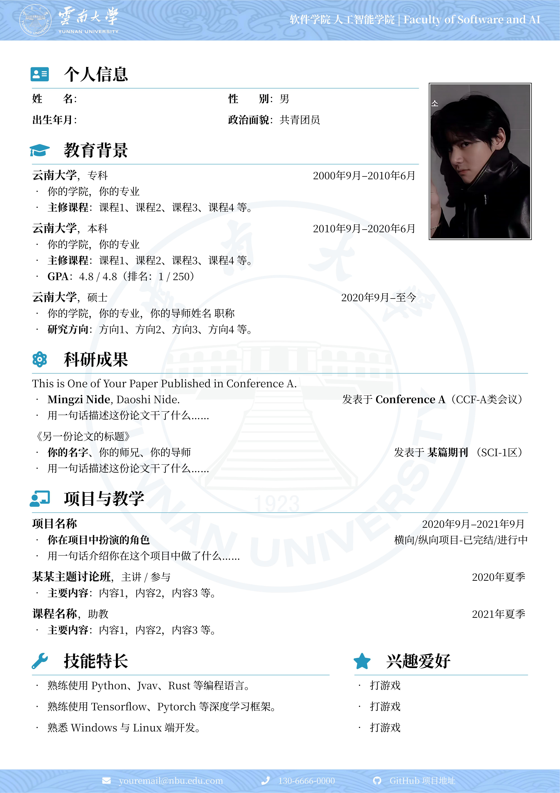

# YNU1：云南大学 LaTeX 中文简历模板



## 简介

基于 [SEU 中文 CV 模板](https://www.overleaf.com/latex/templates/seu-cv-dong-nan-da-xue-latex-zhong-wen-jian-li-mo-ban/jyzpthvnbmpm)
以及 [NPU 中文 CV 模板](https://www.overleaf.com/latex/templates/npu-cv/mncqzxhvfzrx)，
并在 [NBU1 宁波大学模板](https://www.overleaf.com/latex/templates/nbu-zhu-bo-da-xue-latex-zhong-wen-jian-li-mo-ban/rwxqrsptnxtq) 的基础上二次修改，适配云南大学视觉风格。

在原有内容的基础上进行了修改：

- 更换了云南大学校徽及横版 Logo（`ynu_logo.png`、`ynu_logo2.png`）
- 更改了页眉页脚的装饰图案（海浪纹样，浅蓝色调）
- 调整了色彩风格，使用与云南大学视觉系统匹配的蓝色（`RGB: 37, 150, 190`）

## 使用方法

- 编辑 `main.tex` 中的内容，对文档样式和内容进行修改。
- 将 `\school` 命令中的学院名称替换为你所在的学院。
- 将 `images/` 文件夹中的头像替换为你的证件照。
- 使用 `XeLaTeX` 或 `LuaLaTeX` 编译。

## 文件结构
```
├── main.tex          # 简历主文件
├── fonts/            # 内置字体（NotoSerifSC）
├── images/
│   ├── head.png      # 页眉背景图
│   ├── foot.png      # 页脚背景图
│   ├── ynu_logo.png  # 云南大学横版 Logo（页眉左侧）
│   ├── ynu_logo2.png # 云南大学校徽（背景水印）
│   └── avatar.png    # 证件照（替换为你自己的）
└── docs/
    └── CV-preview.jpg
```

## 致谢

- [SEU CV 模板](https://www.overleaf.com/latex/templates/seu-cv-dong-nan-da-xue-latex-zhong-wen-jian-li-mo-ban/jyzpthvnbmpm)
- [NPU CV 模板](https://www.overleaf.com/latex/templates/npu-cv/mncqzxhvfzrx)
- [NBU1 宁波大学模板](https://www.overleaf.com/latex/templates/nbu-zhu-bo-da-xue-latex-zhong-wen-jian-li-mo-ban/rwxqrsptnxtq)